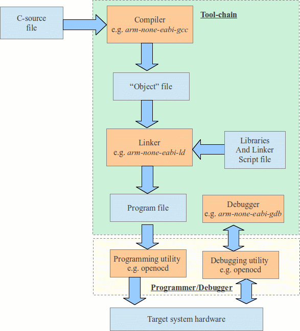
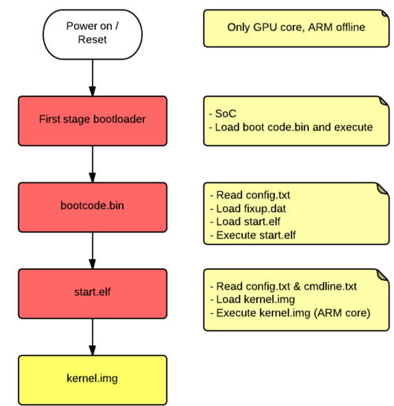
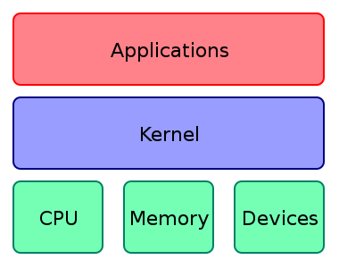
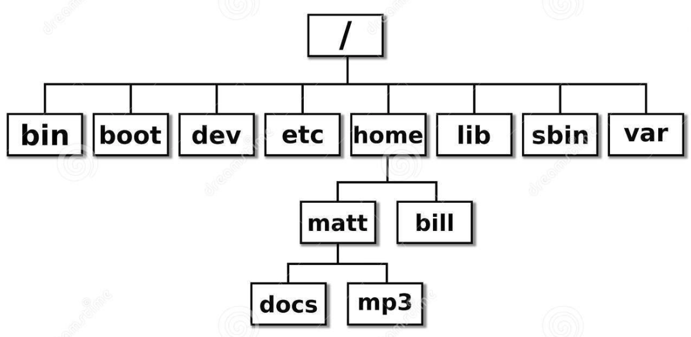

# Criação de um sistema Linux

Elementos básicos:

* _Toolchain_
* _Bootloader_
* _Kernel_
* _Rootfs_

## _Toolchain_

_Toolchain_ é o conjunto de ferramentas de desenvolvimento de software. Ela é composta de:

1. **Pré-processador**: trata todas as diretivas de pré-processamento (```#define``` etc.) e gera um código C intermediário.
2. **Compilador**: converte este código C intermediário em um código-fonte _assembly_.
3. **Assembler**: converte o código-fonte _assembly_ em arquivo objeto.
4. **Linker**: converte um ou mais arquivos objeto no binário final (_firmware_, aplicação, etc).



Uma _toolchain_ pode ser nativa (_native toolchain_) ou de compilação cruzada (_cross-compiling toolchain_). No primeiro caso, a _toolchain_ compila código para ser executado em um processador da mesma família. No outro caso, ela compila código para ser executado em outra família de processadores, economizando recursos no dispositivo-alvo (por exemplo, evitando a instalação do GCC no Raspberry Pi).

A _toolchain_ de compilação cruzada para o Raspberry Pi está disponível em https://github.com/raspberrypi/tools.

## _Bootloader_

Quando uma CPU é energizada inicialmente, ela não possui código para executar na sua memória principal. O _bootloader_ é um sistema que fornece este código inicial.

O termo _boot_ vem de _bootstrap load_, que por sua vez vem da frase "_to pull oneself up by one's bootstraps_", ou "se levantar pelas próprias alças das botas". É uma variante do paradoxo do ovo e da galinha, implicando que é impossível a CPU iniciar sua execução sem código para iniciar sua execução. Por isso, é necessário algum _hardware_ externo ou _firmware_ para iniciar o processo de _boot_.

O processo de _boot_ no Raspberry Pi segue estes passos:

[1]

## _Kernel_

O _kernel_ é o núcleo do sistema operacional, servindo de ponte entre aplicativos e o _hardware_ do computador, o que inclui:

* CPU: ordem de execução dos processos etc.
* Memória: localização e acesso de dispositivos de memória para os aplicativos (memória RAM, cache etc.).
* Dispositivos de entrada e saída: teclados, _mouses_, HDs, impressoras, telas e adaptadores de rede, dentre outros.

O _kernel_ também gerencia recursos de aplicativos, tais como a memória utilizada e a identificação de processos e _threads_, e realiza o sincronismo e a comunicação entre eles.



## _Rootfs_

O Linux diz respeito somente ao _kernel_ do sistema operacional. Para completar este, são necessários aplicativos, bibliotecas e um sistema de arquivos. Este último é montado pelo _kernel_ quando este termina seu processo de inicialização. O _kernel_ também procura e executa uma aplicação que configura e inicializa o restante do sistema operacional (geralmente o processo ```init```).

_Rootfs_ significa _root file system_, o sistema de arquivos típico de sistemas operacionais baseados em _kernel_ Linux. Ao montar o _rootfs_, o acesso aos dados de diretórios e arquivos é disponibilizado a partir do diretório ```/``` do sistema.



Para montar o _rootfs_, o _kernel_ verifica durante o _boot_ do sistema qual partição corresponde à pasta ```/``` e qual sistema de arquivos deve ser utilizado (ext2, ext3, ext4, ntfs etc.) para esta partição. Diferentes tipos de sistemas de arquivos existem para atenderem a objetivos específicos: melhor performance, maior segurança, menor uso de espaço em disco etc.:

* Alguns sistemas de arquivo, como o ext3 e o btrfs, possuem _journaling_, em que todas as alterações em disco são gravadas em um _journal_, uma espécie de _log_, antes de escrever em um arquivo. Após a atualização no arquivo, a entrada no _journal_ é removida. Se houver um _crash_ do sistema, ou um _reboot_ inesperado, as entradas completas não-apagadas no _journal_ podem ser lidas e recuperadas.
* Sistemas de arquivo comprimidos, como o CramFS e o SquashFS, armazenam os dados de forma comprimida no dispositivo de armazenamento, economizando espaço em disco.  
* Sistemas de arquivo voláteis, como o ramfs e o tmpfs, permitem manter um diretório no sistema montado em RAM, para maior velocidade de escrita e leitura. Estes dados são perdidos após o _reboot_ do sistema.
* O NFS (_Network Filesystem_) permite a montagem de um sistema de arquivo pela rede, acelerando o processo de desenvolvimento de aplicações embarcadas por exemplo.

# Referências

* https://sergioprado.org/como-desenvolver-um-sistema-linux-do-zero-para-a-raspberry-pi/
* https://sergioprado.org/desmistificando-toolchains-em-linux-embarcado/
* https://www.raspberrypi.org/documentation/hardware/raspberrypi/bootmodes/bootflow.md
* https://quorten.github.io/quorten-blog1/blog/2018/09/24/rpi-otp-doc
* https://en.wikipedia.org/wiki/Kernel_(operating_system)
* https://sergioprado.org/sistemas-de-arquivo-em-linux-embarcado-parte-1/

[[1]](https://www.raspberrypi.org/documentation/hardware/raspberrypi/bootmodes/bootflow.md) Inicialmente, a memória OTP (_one-time programmable memory_) é lida para decidir quais modos de _boot_ são válidos e estão habilitados. A ordem já instalada é o _boot_ pelo cartão SD, seguido do _boot_ por um dispositivo USB.

A ROM de _boot_ confere na OTP se os dois bits **GPIO_boot_mode** foram programados - um para habilitar a escolha do modo de _boot_ pelo GPIO, e outro para escolher o banco de GPIOs usados para desabilitar outros modos de _boot_ (low = GPIOs 22-26, high = GPIOs 39-43). Assim, é possível usar um botão físico para escolher dentre os modos de _boot_ disponíveis 

Os bits OTP do modo de inicialização GPIO podem ser programados adicionando-se ```program_gpio_bootmode = n``` ao arquivo ```config.txt```, onde n é 1 para selecionar o banco baixo (GPIOs 22 a 26) ou 2 para selecionar o banco alto (GPIOs 39 a 43). Uma vez adicionado, inicialize o dispositivo e, em seguida, ligue-o (a reinicialização não é suficiente). Você deve esperar que ele não inicialize mais (todos os modos de inicialização serão desativados por padrão). Aplique um pull-up no pino necessário para ativar o modo de inicialização necessário. Após a programação, a configuração em ```config.txt``` pode ser removida.

É importante lembrar que, uma vez definidos, os bits OTP nunca podem ser desconfigurados, portanto, pense cuidadosamente antes de ativar esse recurso, pois ele efetivamente torna 5 GPIOs inutilizáveis para outros propósitos. Observe também que as designações de bits permitem alternar do banco baixo (22-26) para o banco alto (39-43), mas não vice-versa, e que selecionar o banco alto provavelmente produzirá um Pi não inicializável, a menos que você esteja usando um _Compute Module_ (qualquer versão).

Não use ```program_gpio_bootmode``` a menos que seu firmware seja datado de 20 de outubro de 2017 ou posterior (```vcgencmd version```). Ao fazer isso, será impossível selecionar o baixo banco de GPIOs no modo de inicialização.
